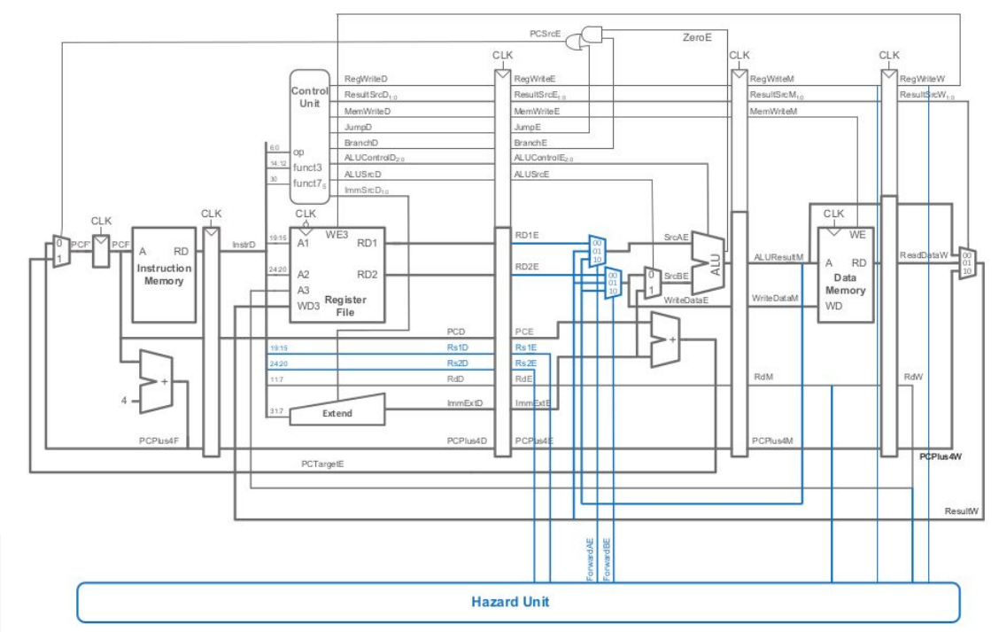
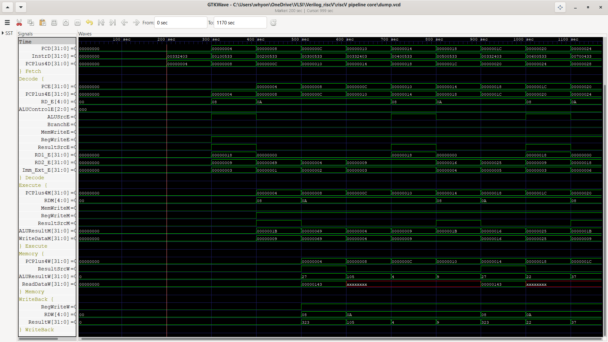
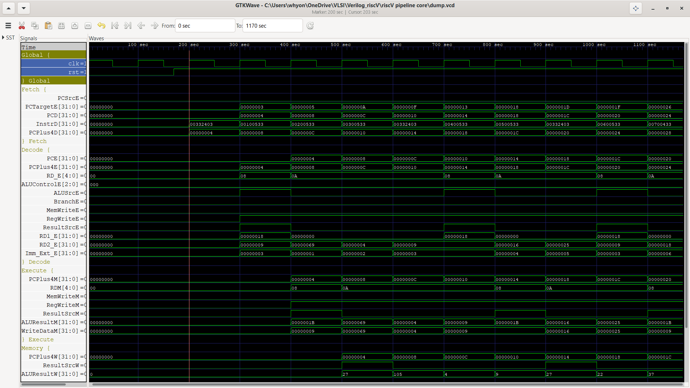
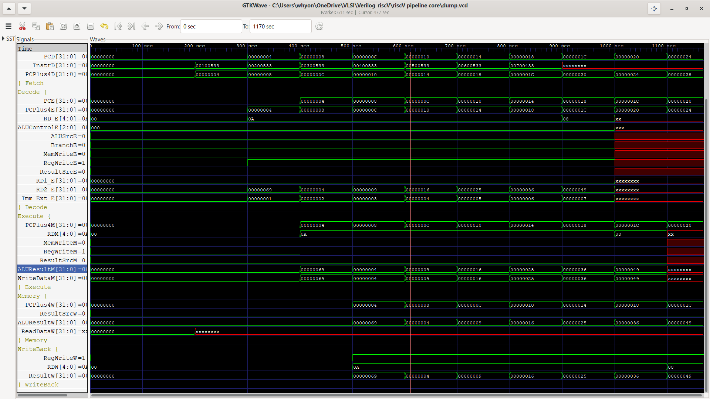

# 5-Stage Pipelined RISC-V Processor

A **32-bit, 5-stage pipelined RISC-V processor** designed and implemented using **Verilog HDL**. The processor follows the classic **IF → ID → EX → MEM → WB** pipeline architecture, allowing multiple instructions to be processed simultaneously and improving instruction throughput.

---

## 🚀 Project Overview

This project implements a modular RISC-V processor with a pipelined datapath and hardware mechanisms for handling data dependencies between instructions.

### Key Features

* 32-bit RISC-V processor
* 5-stage pipelined architecture
* Instruction Fetch (IF)
* Instruction Decode (ID)
* Execute (EX)
* Memory Access (MEM)
* Write Back (WB)
* Modular RTL datapath
* Arithmetic and Logic Unit (ALU)
* 32 × 32-bit register file
* Instruction memory
* Data memory
* Control unit
* Pipeline registers
* Hazard detection logic
* Forwarding / bypassing logic
* Support for resolving data dependencies between instructions

---

## 🏗️ 5-Stage Pipeline Architecture

The processor is divided into five pipeline stages:

```text
        ┌──────┐     ┌──────┐     ┌──────┐     ┌──────┐     ┌──────┐
        │  IF  │────▶│  ID  │────▶│  EX  │────▶│ MEM  │────▶│  WB  │
        └──────┘     └──────┘     └──────┘     └──────┘     └──────┘
           │            │            │            │            │
          PC         Register       ALU         Data        Register
        + 4         File/CU       Execute      Memory        Write
```

### 1. Instruction Fetch — IF

* The Program Counter (PC) generates the instruction address.
* Instruction memory provides the instruction.
* The PC is updated to fetch the next instruction.
* The fetched instruction is stored in the **IF/ID pipeline register**.

### 2. Instruction Decode — ID

* The instruction is decoded according to the RISC-V instruction format.
* Source operands are read from the register file.
* Immediate values are generated.
* The control unit generates the required control signals.
* The decoded information is stored in the **ID/EX pipeline register**.

### 3. Execute — EX

* The ALU performs arithmetic and logical operations.
* Immediate or register operands are selected according to the instruction.
* Effective addresses for load/store instructions are calculated.
* Forwarding logic provides the latest operand values when required.
* Results are stored in the **EX/MEM pipeline register**.

### 4. Memory Access — MEM

* Load and store instructions access the data memory.
* The ALU-generated address is used for memory operations.
* Data read from memory is passed toward the Write-Back stage.
* Relevant control signals are stored in the **MEM/WB pipeline register**.

### 5. Write Back — WB

* The final result is selected from the ALU result or memory data.
* The selected value is written back to the destination register.
* The instruction completes its execution.

---

## ⚙️ RTL Architecture

The processor is implemented using a modular RTL design consisting of the following major components:

```text
                     ┌──────────────────┐
                     │ Program Counter  │
                     └────────┬─────────┘
                              │
                              ▼
                     ┌──────────────────┐
                     │ Instruction      │
                     │ Memory           │
                     └────────┬─────────┘
                              │
                           IF/ID
                              │
                              ▼
                     ┌──────────────────┐
                     │ Decode & Control │
                     │ Register File    │
                     │ Immediate Gen.   │
                     └────────┬─────────┘
                              │
                           ID/EX
                              │
                              ▼
                     ┌──────────────────┐
                     │       ALU        │
                     │ Forwarding Logic │
                     └────────┬─────────┘
                              │
                           EX/MEM
                              │
                              ▼
                     ┌──────────────────┐
                     │   Data Memory    │
                     └────────┬─────────┘
                              │
                           MEM/WB
                              │
                              ▼
                     ┌──────────────────┐
                     │   Write Back     │
                     │  Register File   │
                     └──────────────────┘
```

### Main Components

* **Program Counter**
* **Instruction Memory**
* **Register File**
* **Control Unit**
* **ALU**
* **Immediate Generation Unit**
* **Data Memory**
* **IF/ID Pipeline Register**
* **ID/EX Pipeline Register**
* **EX/MEM Pipeline Register**
* **MEM/WB Pipeline Register**
* **Hazard Detection Unit**
* **Forwarding / Bypassing Unit**

---

## 🔄 Hazard Detection & Forwarding

Pipelining can introduce **data hazards** when an instruction depends on the result of a previous instruction that has not yet completed.

For example:

```assembly
ADD x3, x1, x2
SUB x4, x3, x5
```

The `SUB` instruction requires the value of `x3`, which is generated by the preceding `ADD` instruction.

### Forwarding / Bypassing

To reduce unnecessary pipeline stalls, the processor implements forwarding logic.

Instead of waiting for the result to be written back into the register file, the required result can be forwarded directly from a later pipeline stage to the Execute stage.

```text
                  ┌───────────┐
        EX/MEM ──▶│           │
                  │ Forwarding├──▶ ALU
        MEM/WB ──▶│    MUX    │
                  │           │
 Register File ──▶│           │
                  └───────────┘
```

This allows dependent instructions to continue through the pipeline with reduced latency.

### Hazard Handling

The hazard-handling logic is responsible for:

* Detecting data dependencies
* Comparing source and destination registers
* Selecting forwarded operands
* Preventing incorrect execution due to stale register values
* Reducing unnecessary pipeline stalls

---

## 🖥️ Processor Schematic

The complete RTL schematic of the **5-stage pipelined RISC-V processor** is shown below.

It illustrates the processor datapath, control logic, pipeline registers, ALU, register file, instruction memory, data memory, and hazard-handling circuitry.

<p align="center">
  
</p>

---

## 🔬 Simulation Results

The processor was verified through simulation using RISC-V instruction sequences.

The simulation waveforms were used to verify:

* Instruction fetching
* Instruction decoding
* ALU operations
* Register read/write operations
* Pipeline stage progression
* Memory operations
* Pipeline register behavior
* Data dependency handling
* Forwarding / bypassing operation

### Simulation Response 1

<p align="center">
  
</p>

### Simulation Response 2

<p align="center">
  
</p>

### Simulation Response 3

<p align="center">
  
</p>

---

## 📁 Repository Structure

```text
5-Stage Pipelined RISC-V Processor/
│
├── src/
│   ├── Verilog RTL source files
│   └── Processor modules
│
├── Schematic.png
├── Response1.png
├── Response2.png
├── Response3.png
│
└── README.md
```

---

## 🧪 Verification

The processor was tested using simulation waveforms to verify the correct interaction between the different pipeline stages and RTL modules.

The verification focused on:

1. Correct instruction fetching
2. Correct instruction decoding
3. ALU operation and operand selection
4. Register file read/write operations
5. Load and store memory operations
6. Correct movement of data through pipeline registers
7. Data hazard detection
8. Forwarding / bypassing of dependent operands
9. Correct final results during Write-Back

---

## 🛠️ Technologies Used

* **Verilog HDL**
* **RISC-V ISA**
* **RTL Design**
* **Digital Logic Design**
* **Computer Architecture**
* **5-Stage Pipelining**
* **Data Hazard Detection**
* **Forwarding / Bypassing**
* **Processor Simulation**
* **Waveform Analysis**

---

## 🎯 Learning Outcomes

This project provided practical experience in:

* Designing a pipelined processor datapath
* Understanding RISC-V instruction execution
* Developing modular RTL using Verilog
* Designing and integrating processor components
* Understanding pipeline timing
* Handling data hazards
* Implementing forwarding and bypassing
* Debugging RTL designs using simulation waveforms
* Understanding the interaction between datapath and control logic

---

## 🔮 Future Improvements

Possible future extensions include:

* Support for a larger subset of the **RV32I instruction set**
* Improved control-hazard handling
* Pipeline flushing
* Branch prediction
* Pipeline stall optimization
* Instruction and data cache implementation
* FPGA implementation
* Performance benchmarking against a single-cycle processor
* Support for additional RISC-V extensions

---

## 👤 Author

**Priyaranjan Rout**
B.Tech — Electrical Engineering
**National Institute of Technology, Rourkela**

---

## ⭐ Project Highlights

> **32-bit RISC-V | 5-Stage Pipeline | Modular RTL | Hazard Detection | Forwarding | Verilog HDL**

This project demonstrates the design and implementation of a complete pipelined processor datapath, combining **computer architecture concepts with practical RTL design and simulation**.

