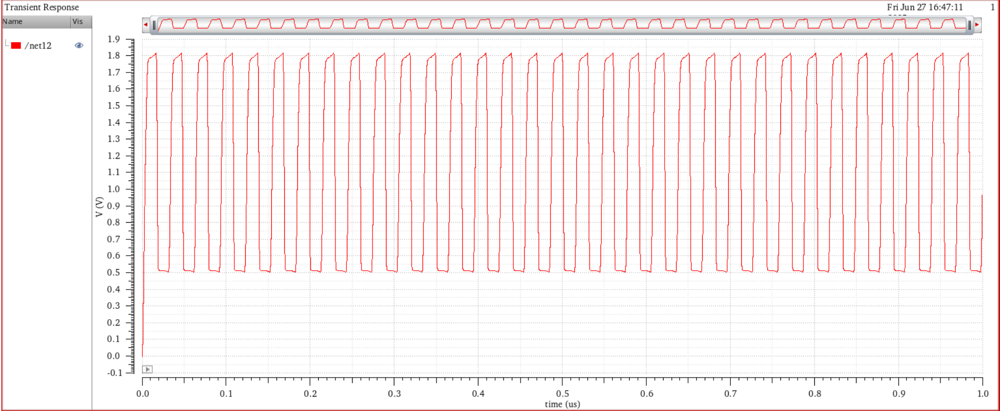
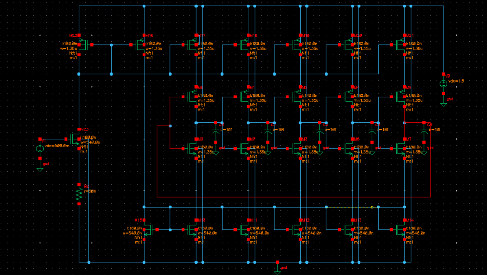

# 5-Stage Current-Starved Ring Oscillator

A CMOS-based 5-stage current-starved ring oscillator designed and simulated using Cadence Virtuoso. The oscillator provides voltage-controlled frequency tuning through current-starved inverter stages and current-mirror biasing.

## 📌 Project Overview

This project focuses on the design and simulation of a **5-stage current-starved ring oscillator** for voltage-controlled oscillation.

The oscillator uses current-starved inverter stages to control the charging and discharging current of the internal capacitive nodes. A current-mirror-based biasing network is used to regulate the available current and hence tune the oscillation frequency with the control voltage.

### Key Specifications

| Parameter | Value |
|---|---|
| Architecture | 5-Stage Current-Starved Ring Oscillator |
| Technology | CMOS |
| Simulation Tool | Cadence Virtuoso |
| Frequency Range | 30–70 MHz |
| Tuning Gain | 60–90 MHz/V |
| Output Swing | Near Rail-to-Rail |
| Biasing | Current Mirror |
| Simulation Types | Transient & AC Analysis |
| Project Date | January 2026 |

## ⚙️ Circuit Architecture

The oscillator consists of:

- Five cascaded current-starved inverter stages
- PMOS and NMOS devices forming each delay stage
- Current mirrors for bias-current generation
- Control voltage for frequency tuning
- Load capacitance at oscillator stages
- Feedback from the final stage to the first stage to sustain oscillation

The current-starved structure limits the current available to each inverter, controlling the propagation delay of each stage.

### Basic Principle

The approximate oscillation frequency of an N-stage ring oscillator is:

\[
f_{osc} \approx \frac{1}{2N t_d}
\]

where:

- \(N\) = number of inverter stages
- \(t_d\) = propagation delay of each stage

For a 5-stage oscillator:

\[
f_{osc} \approx \frac{1}{10t_d}
\]

Changing the control voltage modifies the bias current, which changes the charging/discharging rate of the stage capacitances and therefore changes the oscillation frequency.

## 🔬 Design Approach

1. Designed a 5-stage CMOS ring oscillator.
2. Implemented current-starved inverter stages to control the stage current.
3. Added current mirrors to establish the required bias current.
4. Applied a control voltage to tune the oscillator frequency.
5. Simulated the circuit using Cadence Virtuoso.
6. Performed transient analysis to verify sustained oscillation.
7. Performed AC analysis to evaluate gain and phase response.
8. Verified frequency tuning with respect to the control voltage.

## 📊 Simulation Results

### Transient Response

The transient simulation demonstrates stable periodic oscillation at the output.

The simulated output exhibits a near rail-to-rail voltage swing with a stable oscillation waveform.

### AC Response

The AC analysis was performed to observe the magnitude and phase response of the circuit.

The response demonstrates the frequency-dependent behavior of the oscillator circuit and its transition toward the high-frequency region.

### Schematic

The schematic shows the complete 5-stage current-starved ring oscillator with current-mirror biasing and capacitive loading.

## 📈 Performance

- **Frequency range:** 30–70 MHz
- **Tuning gain:** 60–90 MHz/V
- **Near rail-to-rail output swing**
- Current-mirror-based bias control
- Voltage-controlled frequency tuning
- Stable periodic oscillation verified through transient simulation

## 🛠️ Tools & Technologies

- **Cadence Virtuoso**
- CMOS Analog Circuit Design
- Current-Starved Inverter
- Current Mirrors
- Ring Oscillator
- Transient Analysis
- AC Analysis
- Frequency Tuning

## 🎯 Learning Outcomes

This project provided practical experience in:

- CMOS inverter and delay-cell design
- Current-starved oscillator architecture
- Current mirror biasing
- Voltage-controlled frequency tuning
- Analog IC schematic design
- Transient and AC simulation
- Analysis of frequency response and phase characteristics
- Cadence Virtuoso-based circuit simulation

## 📁 Repository Contents

- `Schematic.png` — Complete oscillator schematic
- `Transient respone.png` — Transient simulation result
- `Response.png` — AC response
- `README.md` — Project documentation

## 👨‍💻 Author

**Priyaranjan Rout**

Electrical Engineering | VLSI & Analog IC Design

## 🔗 Project Repository

[View Project on GitHub](https://github.com/priyaranjanrout/Electronics-Projects/tree/main/Ring%20Oscillator)
